# Project: Expense Tracker

A personal finance management app that helps students track their daily expenses, manage budgets, and save money efficiently.


##📌 Project Overview
The Smart Expense & Budget Tracker for Students is a Flutter-based mobile application designed to help students manage their finances effectively. Built for Android, the app allows users to track daily expenses, set monthly budgets, monitor savings goals, and view spending reports. It uses sqflite for offline storage, ensuring data persistence without internet access. The app features a modern, user-friendly UI with animations, a light/dark theme toggle, and category filtering, meeting all core requirements and bonus features for enhanced user experience.
It includes all required features, a polished UI/UX, and robust offline storage, aiming to maximize marks across functional features, UI/UX design, data persistence, code structure, performance, and documentation.

## 🛠️ Features

### Core Features

- Expense Logging & Categorization: Log expenses with titles, amounts, dates, and categories (e.g., Food, Transport, Entertainment, Bills, Other).
- Budget Setting & Alerts: Set monthly budgets and receive notifications when overspending.
- Savings Goals & Reminders: Create and track savings goals with reminder notifications.
- Simple Reports & Graphs: Visualize spending habits with bar charts and category breakdowns.
- Offline Storage: Store all data (users, expenses, budgets, savings goals) locally using sqflite.
- Animations: Smooth fade-in transitions, slide-in list items, and button scale animations for a dynamic UX.
- Category Filtering: Filter expenses by category in the reports section.
- Theme Toggle: Switch between light and dark themes for accessibility and preference.
- Budget Validation: Prevents expense addition if no budget is set for the current month.
- Budget Reduction: Automatically reduces the current month's budget when an expense is added.


## 📱 Installation & Setup

### Prerequisites

Flutter SDK: Version 3.24.0 or higher (recommended).
Dart: Version included with Flutter SDK.
Android Emulator or Physical Android Device: Android API level 21 or higher.
Git: To clone the repository.
IDE: Android Studio, VS Code, or any Flutter-compatible IDE.

### Steps to Run the App

1. Clone the Repository:
    - git clone https://github.com/Dujohnson7/Expense_Tracker_Mobile_Final
    - cd expense-tracker

2. Install Dependencies:Run the following command to fetch all required packages:

   - flutter pub get 
   - Set Up the Android Emulator:
   - Open Android Studio and configure an Android emulator (API level 21+). 
   - Alternatively, connect a physical Android device with USB debugging enabled.


3. Run the App:

    - Ensure an emulator or device is running.
    - Execute the following command:flutter run


4. Install the APK (Alternative):

- The release APK is located in the apk folder (apk/app-release.apk).
- Install it on an emulator or device:adb install apk/app-release.apk

Alternatively, copy the APK to your device and install it manually.


## Project Structure
```text
expense-tracker/
├── android/                    # Android-specific files
├── ios/                        # iOS-specific files  
├── lib/                        # Flutter source code
│   ├── models/                 # Data models (User, Expense, Budget, SavingsGoal)
│   ├── screens/                # UI screens (Login, Signup, Home, AddExpense, Budget, SavingsGoal, Reports)
│   ├── services/               # API and offline storage services
│   ├── theme/                  # Theme configuration (light/dark modes)
│   ├── utils/                  # Utility functions (notifications)
│   ├── widgets/                # Reusable widgets (ExpenseTile, SavingsGoalTile)
│   └── main.dart               # App entry point
├── apk/                        # Release APK (app-release.apk)
├── pubspec.yaml                # Dependencies and project configuration
└── README.md                   # Project documentation
```
## 📸 Screenshots

### SignUp Screen:

Description: Clean Signup interface with gradient background and animated button.

- 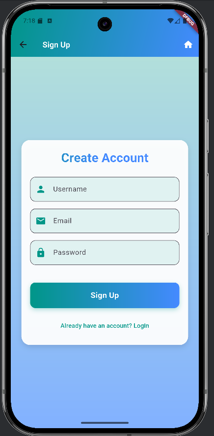
- 

### Login Screen:

Description: Clean login interface with gradient background and animated button.

- 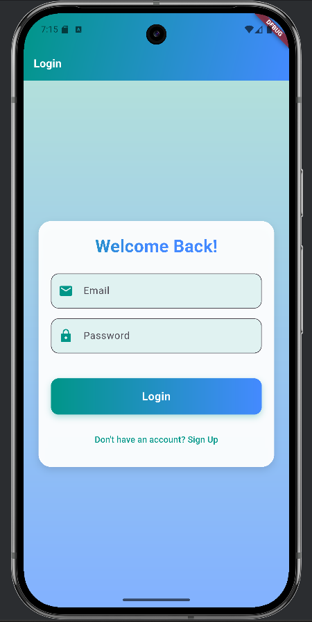
- 

### Home Screen:

Description: Displays welcome message, budget overview, recent expenses, and savings goals with neumorphic cards.

- 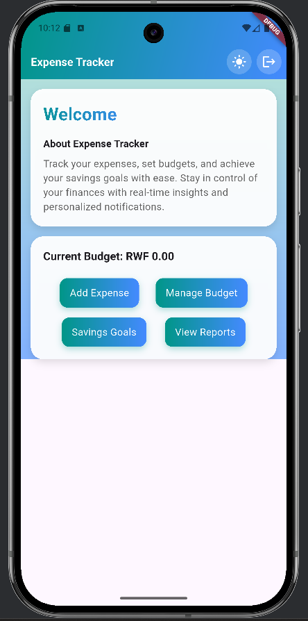
- 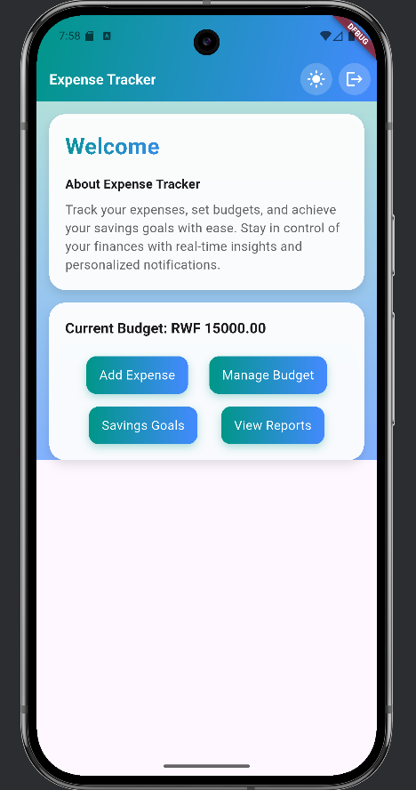

### Add Expense Screen:

Description: Form to log expenses with category selection and budget validation.

- 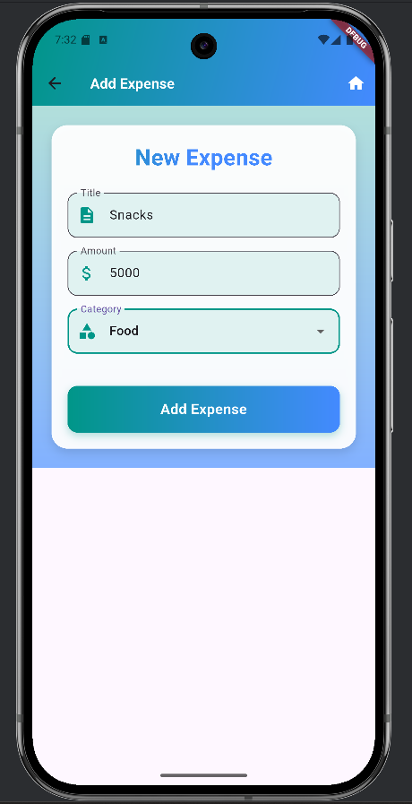

### Budget Screen:

Description: Set and view monthly budgets with a modern UI.

- 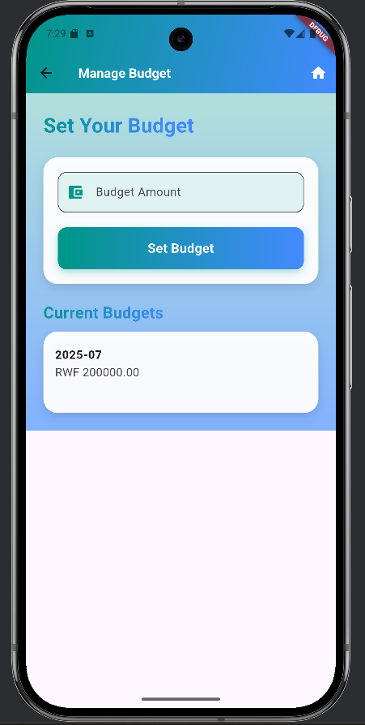

### Savings Goal Screen:

Description: Create and track savings goals with reminder date picker.

- 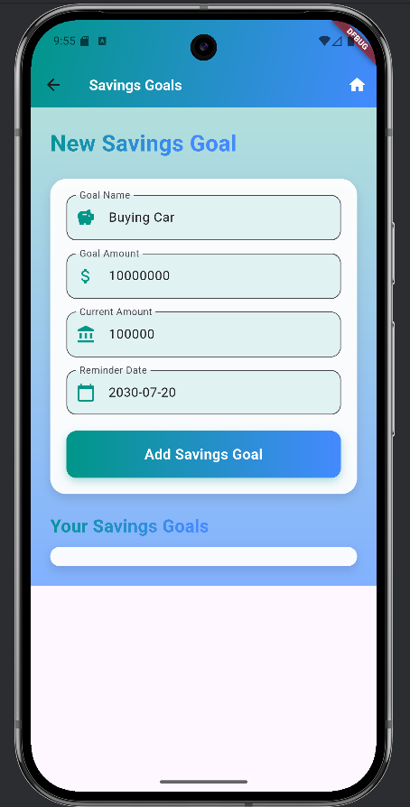
- 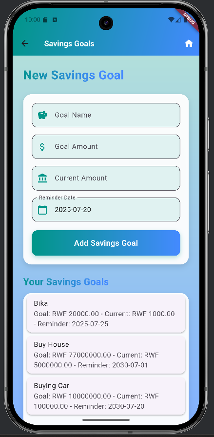

### Reports Screen:

Description: Visual spending reports with bar charts and category filters.

- 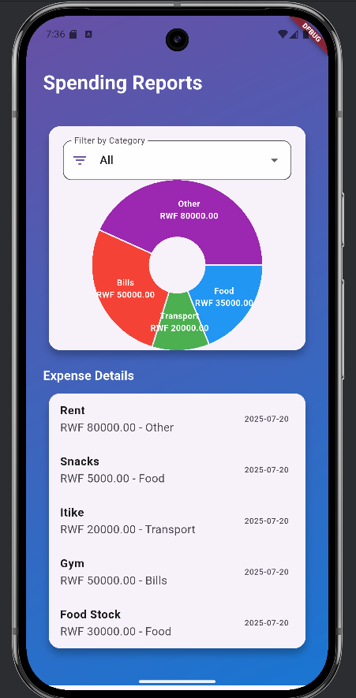
- 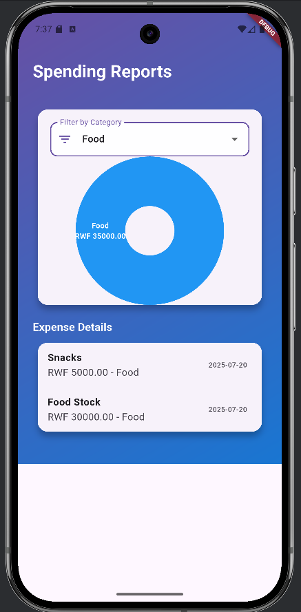 
- 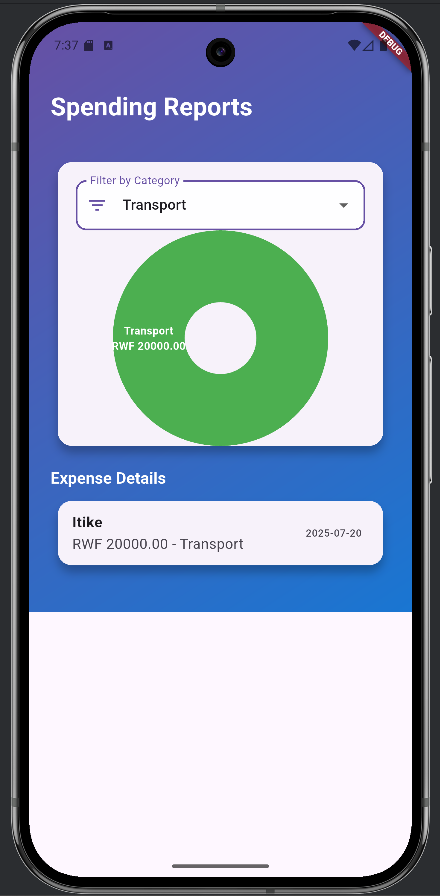


### 📚 Dependencies
Key dependencies used in the project (see pubspec.yaml for the full list):

- flutter: SDK for building the app.
- sqflite: For offline database storage.
- shared_preferences: For storing user session data.
- provider: For state management (theme toggle).
- crypto: For password hashing.
- charts_flutter: For report visualizations.


## Clone the Repository:
git clone https://github.com/Dujohnson7/Expense_Tracker_Mobile_Final
